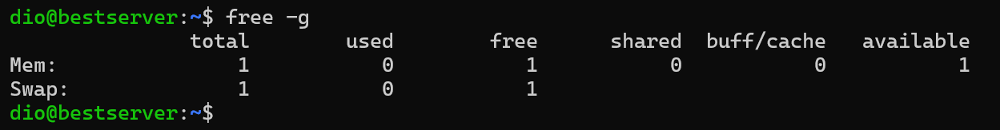
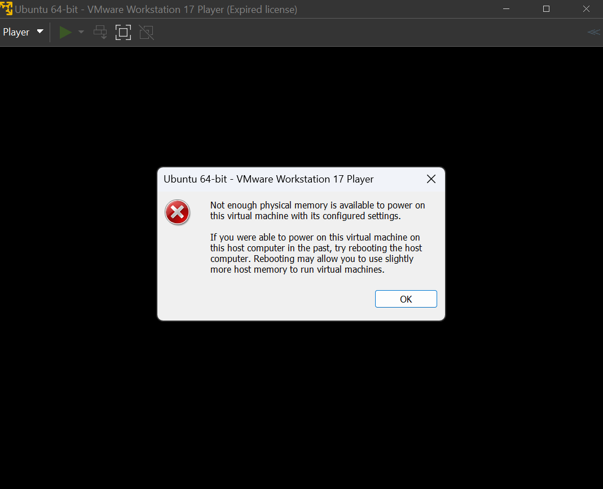

## Screenshots:

### Logische Prozessoren:

### Logisch Prozessoren für VM aufgeteilt (weniger):

### Logische Prozesorren für VM aufgeteilt (mehr): 

### RAM für VM aufgeteilt (weniger):

### RAM für VM aufgeteilt (mehr "128gb"):

## Erklärung:

Man kann nicht mehr Logische Prozessoren für die VM aufteilen, weil man nur die anzahl an Logischen Prozessoren brauchen kann die man verbaut hat. 

Man kann nicht mehr RAM zuteilen als man Speicher frei hat. Ich hatte nicht mehr speicher als 128gb frei und daher bekam ich die fehlermeldung des Host-Systems.